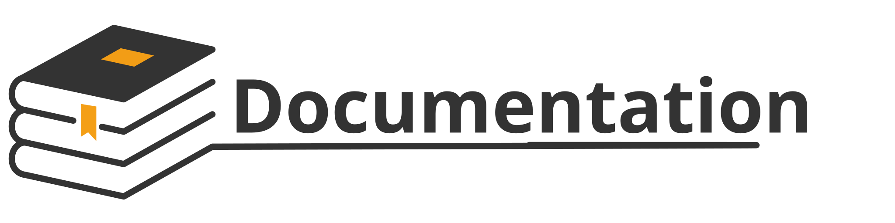

# Project Documentation Framework



Demo: https://docs.yousysadmin.com

**Sources:**

Hugo template: [Hextra](https://github.com/imfing/hextra)

Documentation Structure source: [Architecture Document Template](https://github.com/bflorat/architecture-document-template/)

Landing page illustration images: [FreePic](https://www.freepik.com)

## Quickstart

### Install Hugo

To get started with the framework, you'll need Hugo. You can:
- [Install it](https://gohugo.io/installation/) globally on your system
- Get its [binary](https://github.com/gohugoio/hugo/releases) and put it in the project's root

### Clone the project, preview locally

Once your system is set up, clone this repository:

```bash
git clone https://github.com/YouSysAdmin/documentation-framework.git
```

Then:

1. Go to the documentation folder: `cd documentation-framework`
2. Run `hugo server` to build and start the local server

Local site is available on <http://localhost:1313>, it refreshes as you modify the files, you can keep the server running with no need to restart.
Find `server` command options in the [Hugo documentation](https://gohugo.io/commands/hugo_server/#options).

## Contributing

You can contribute by [creating an issue](https://github.com/YouSysAdmin/documentation-framework/issues) or [submitting a pull request](https://github.com/YouSysAdmin/documentation-framework/pulls).

## Adding a new page or guide

To generates a file from a template (in `/archetypes`), run one of the following Hugo commands:

```bash
hugo new content /docs/my-project/<doc-name>.md
```

In new page/guide front matter, `draft` is set to `true` to prevent it from being mistakenly published.

> [!TIP]
> Use `hugo server --buildDrafts` command to preview drafts locally

### Adding a changelog entry

For any significant change to the platform (updates, new features, etc.) a new entry is created in the `content/changelog` folder.

Several entries can be made per day, it's not a problem. Each entry should provide clear, straightforward information on the essentials. If you find yourself writing an enormous amount of content, this may not be the right approach. However, you can always add a little charm to your changelog, but it's a tricky business, requiring careful, well-placed word choice.

The filename format is a markdown file with a `.md` extension:

```
/yyyy/mm-dd-your-title.md
```

```shell
hugo new changelog/2025/10-17-changes.md
```

### Front matter configuration

Hugo uses front matter to enrich posts with metadata. Front matter allows you to keep metadata attached to an instance of a content type—i.e., embedded inside a content file. We use the following Front matter variables:

- [`type`](https://gohugo.io/methods/page/type/) (optional)
  - The type of content layout to apply. The value is a `<string>`, set it to `docs` except in changelog.

- [`weight`](https://gohugo.io/methods/page/weight/) (optional)
  - The weight of the content, used to order the sidebar. The value is an `<integer>`, default is `0`.

- [`linkTitle`](https://gohugo.io/methods/page/linktitle/) (optional)
  - The title of the content displayed in the sidebar. The value is a `<string>`, default is the `title` value.

- [`title`](https://gohugo.io/methods/page/title/) (required)
  - The title displayed in the main heading. The value is a `<string>`.

- [`description`](https://gohugo.io/methods/page/description/) (recommended)
  - The description displayed in meta-description for SEO purposes. The value is a `<string>`.

- [`excludeSearch`](https://imfing.github.io/hextra/docs/guide/configuration/#search-index) (optional)
  - Indicates whether the page should be indexed in search. Default is `false`, we recommend setting it to `true` for changelog entries.

- [`aliases`](https://gohugo.io/methods/page/aliases) (optional)
  - Aliases redirects the user to the right page. The value is a list of `<string>`, each string being a path to redirect from, relative to the base URL (without the `/developer`, for example: `/doc/docker`).

- [`comments`](https://gohugo.io/content-management/comments/) (optional)
  - Whether to show the feedback block or not. The value is a `<boolean>`, default is `true`.

- [`draft`](https://gohugo.io/methods/page/draft/) (optional)
  - Whether the page is a draft or not. The value is a `<boolean>`, default is `false`. If set to `true`, the page is not built except if you use the `--buildDrafts` flag.

- [`keywords`](https://gohugo.io/content-management/front-matter/#keywords) (optional)
  - Keywords are used for SEO purposes. The value is a list of `<string>`, each string being a keyword.

- [`tags`](https://gohugo.io/content-management/front-matter/#taxonomies) (recommended)
  - Tags are recommended only in Changelog for easy product identification. They are written in lowercase and, if possible, use the same spelling throughout the posts. The value is a list of `<string>`.

- [`authors`](https://gohugo.io/content-management/front-matter/#taxonomies) (mostly used in changelog)
  - Can be set to showcase the people behind the product. Authors are defined with a `name`, `link` for their Github or any other social network, and an `image` for the profile picture. The profile picture can be set with the GitHub avatar with a link like `https://github.com/BlackYoup.png` and the parameter `?size=40` for reducing the image size (recommended for performance). The values are all of `<string>` type.

- [`date`](https://gohugo.io/methods/page/date/) (mostly used in changelog)
  - The date that will be displayed in the post. The value is a string in ISO 8601 like `yyyy-mm-dd`.

For example, a changelog entry front matter could look like this:

```yaml
---
title: Documentation updated
description: Added SSH configurations
date: 2025-10-17
tags:
  - ssh
authors:
  - name: YouSysAdmin
    link: https://github.com/yousysadmin
    image: https://github.com/yousysadmin.png?size=40
excludeSearch: true
---
```

### Adding a new shared content

You can include shared content in several pages. To use this feature:

1. Create a new markdown file in `/shared`
2. Add it to the relevant pages with: `{}`

> [!TIP]
> If you need to include a shared content including shortcodes, use `{}` instead. Don't include headings (starting with `#`) in it as they won't be rendered in the page Table of Contents (ToC).

## Tooltips

Tooltips are useful to provide additional information on terms or acronyms that may not be familiar to all readers. They help improve the accessibility and comprehension of your documentation without cluttering the main text.

To create a tooltip, add the term and its associated tooltip definition in the [`data/tooltips.toml`](./data/tooltips.toml) file. Once defined, tooltips automatically display when users hover over associated terms in the documentation.
