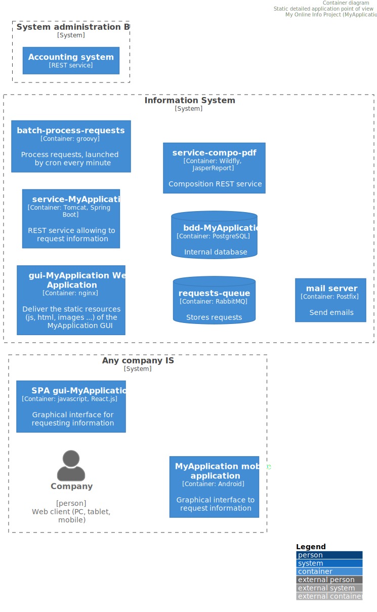

## 1. Introduction

This is the application point of view of the project. It describes the application modules in play and their exchanges.

### 1.1 Reference Documentation


Mention here the reference (defined at a IS level) architecture documents. This file should never summarize their content under penalty of quickly becoming
obsolete and unmaintainable.

**Example:**

| N° | Version	 | Document title / URL | Detail |
|----|----------|----------------------|--------|
| 1  | 6.0      | 6.0_app.pdf          | IS     |


## 2.0 Not ruled

### 2.1 Points subject to further study



**Example:**

| Subject           | Detail                                                                                                                          | Status  | Subject bearer | Deadline    |
|-------------------|---------------------------------------------------------------------------------------------------------------------------------|---------|----------------|-------------|
| Use of Y services | Depending on the progress of project Y, this component could call the services of the latter or those of the former component Z | PENDING | Project Y team | BEFORE 2040 |



### 2.2 Assumptions


**Example:**

| ID  | Detail                                                                                                                                            |
|-----|---------------------------------------------------------------------------------------------------------------------------------------------------|
| HA1 | Even if the decision to generalize the centralized directory is not fully endorsed, the application will rely on it and not on a local directory. |



## 3. General context

### 3.1 Objectives


Briefly describe the project and recall its objectives. Highlight those which are structuring for the architecture.

**Example 1:** This application allows suppliers invoices dematerialization and easy consultation of these documents by the accounting services.

**Example 2:** This project is the rewrite in web technologies of the X legacy application. It should ease the maintenance.

**Example 3:** The X application is one of the main components of the Y program. It leverages the person and billing repositories to enrich the CMS with
real-time customer data.


### Existing


If this document presents a redesign or migration project, describe briefly the existing application. Do not repeat the documentation, simply refer to it and
point to its architecture document if available. Beware of mentioning any information with a strong impact on the new project.

**Example 1:** The GOLD application is a Client-Server application in FORMS 4 pointing to an Oracle 9i database. Its architecture document is given in [REFxyz].

**Example 2:** The existing application is based on an LDAP directory for its authorizations. The new project has to coexist temporary with the former one.
Thus, it is important to manage concurrent accesses as well as the coherence of LDAP during the tiling period.


### 3.3 Positioning in the IS


If the IS is urbanized, identify the block concerned by the project.


### 3.4 Actors

#### 3.4.1 Internal actors



By the term "internal", the IT team project refers to actors belonging to the organization. These actors can be humans or application components.

List of internal actors

| Actor                   | Description                      | Population | Location       |
|-------------------------|----------------------------------|------------|----------------|
| Administration system B | Provides company accounting data | N/A        | Canadian stack |
| Agent                   | Back-office agent                | 100        | Canadian stack |
|                         |                                  |            |                |



#### 3.4.2 External actors



List of external actors

| Actor         | Description             | Population | Location                                                           |
|---------------|-------------------------|------------|--------------------------------------------------------------------|
| Web client    | A company from a PC     | Max 1M     | 10 calls to the GUI per session, one session per day and per actor |
| Mobile client | A company from a mobile | Max 2M     | Worldwide                                                          |



## 4. Constraints

### 4.1 Budget


Give the budget constraints of the project

**Example 1:** Overall envelope of $1M

**Example 2:** Cloud infrastructure should cost less than $20K a month


### 4.2 Planning


Without detailing the project schedules, it is suggested to highlight interesting elements for the architecture.

**Example 1:** Application Launch before February 2034, prerequisite for the HEAVY program in May 2034.


### 4.3 Urbanization


List here the constraints relating to urbanization, this includes for example but not only:

- The rules applicable for calls between components (SOA)
- Call rules between network zones
- The rules concerning the localization of data (MDM)
- The rules concerning the propagation of updates by events (EDA)

**Example 1:** Calls between two services are prohibited except service calls to a nomenclature service.

**Example 2:** to ensure freshness, it is forbidden to replicate data from the PERSON repository. The latter must be interrogated synchronously if necessary.

**Example 3:** When modifying an order, the accounting and invoicing areas will be updated asynchronously via an event.

**Example 4:** All the batches must be able to operate in competition with the UIs without locking the resources.

**Example 5:** Services cannot be called directly. The calls must be made via an exposed route at the level of the company bus which will in turn call the
service. It is then possible to control, prioritize, orchestrate or manage the calls.

**Example 6:** The components of this application follow the SOA architecture as defined in the reference document X.

**Example 7:** Components in an Internet zone cannot call components in an Intranet zone for security reasons.


### 4.4 Legals


List here (without detailing too much) any legal constraints related to the project.

**Example 1:** The framework contract established with the ESN XYZ provides for the transfer to our company of the copyright on the source code.

**Example 2:** The project code will be under the free and open source license GPL V3.

**Example 3:** The data exposed by the project will be licensed under ODS-By.

**Example 4:** The EULA of the software package provides access to sources for users with shares in the company.


## 5. Requirements


Give here the application architecture requirements that can be applied to the project.

**Example 1:** (migration project): The legacy system being rewrote should be subject to as few adaptations as possible.

**Example 2:** The modules must be able to interface with the partner XYZ via their APIs.

**Example 2:** Development should be able to take place within distributed teams, each working on separate modules.


## 6. Target architecture

### 6.1 General application architecture


Present here the application as a whole (without detailing its sub-components) in relation to the other applications of the IS. Also present the macro-data
exchanged or stored.

Summarize:

- The kind of architecture (client-server, monolithic Web, SOA, micro-service ...).
- Large network flows between components or between applications in the case of monoliths.
- Any derogation to applicable architectural rules.

If the application is planned to be implemented in several stages, briefly describe the target trajectory.

The choice of representation is free but a C4 diagram from System Landscape or a UML2 component diagram seems the most suitable.

Numbering the steps in chronological order ensures a better understanding of the diagram. Group the sub-steps by the notation x, x.y, x.y.z, ...

Do not include specific infrastructure system (SMTP server, security device, reverse proxy, LDAP directories, etc.) which are in the domain of technical
architecture. On the contrary, mention Enterprise Service Buses, API Gateway or similar components if they play an application role (service orchestration for
example).

**Example 1:** AllMyData allows a company to retrieve by email a document summarizing all the information the administration has on it. The administration can
supplement its data with those of another administration.

**Example 2:** AllMyData is made up of several independent microservices (GUI components, batches or REST services).

**Example 3:** Thanks to the August 03, 20xx derogation, the GUI will be written using an SPA (Single Page Application) technology.



### 6.2 Detailed application architecture


Detail here all the components of the application, the flows between them and with the other applications of the IS.

Provide one or more diagrams (preferably C4 diagrams of the container type or UML2 component diagram).

Ideally, the diagram will fit on an A4 page and be self-supporting and understandable by non-ICT staff. It should become one of the most important documentary
artifacts and be in the war room or be printed by every developer.

If the application is particularly complex, draw a diagram for each linking chain.

Use a simple non-significant sequence (1, 2, ..., n) as the flow ID. The flows are logical and not technical (for example, we can represent a direct HTTP flow
between two components when in reality, it passes through an intermediate load balancer: this level of detail will be given in the infrastructure section).

For each stream, give the protocol, a synchronous/asynchronous attribute, a read/write/execute attribute and a description so that the scheme is
self-supporting.


#### 6.2.1 Principles that dictated the choices


Give here the intention in the architecture conception.

**Example:** we will use a monolithic and non-micro-service approach due to a lack of expertise within the IT project team.


#### 6.2.2 Static view


Expose the application modules in their different zones or domains.

**Example:** module X, Y and Z in the ACCOUNTING domain. Modules A, B in the PERSON domain.



#### 6.2.3 Dynamic view


Expose the application modules in their different areas or domains with their main application flows.

Do not detail technical flows (such as flows related to monitoring or clustering).

If the application is complex, propose a global diagram listing all the application flows and then a diagram for each main linking chain by numbering the
exchanges (use a sequence diagram or (better) a C4 Dynamic Diagram). It is also possible to detail the linking chains by main functionality.

**Example:**



### 6.3 Matrix of application flows


List here the main network flows of the application.

Do not detail the monitoring or clustering streams for example. Indicate the type of network (LAN, WAN).

**Example:**

| Source                 | Destination                   | Network type | Protocol      | Mode |
|------------------------|-------------------------------|--------------|---------------|------|
| Company                | PC / tablet / external mobile | WAN          | gui-allmydata | R    | 
| batch-process-requests | service-compo-pdf             | LAN          | HTTP          | C    | 
| ...                    | ...                           | ...          | ...           |      | 

**Mode:** Read\(R), Write (W) or Call\(C) to a stateless system.

