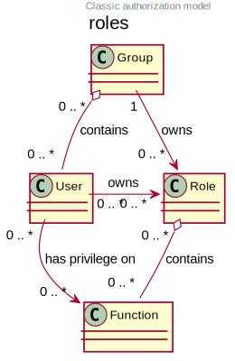

## 1. Introduction

This is the security point of view. It describes all the measures implemented to prevent unauthorized use,
misuse, illegitimate modification, or misappropriation of application modules.


Availability is dealt with in the infrastructure section. Even if availability concept is often handled with Integrity and Confidentiality (the "CIA triad"),
this model is role-oriented and we feel that availability is more often managed by infrastructure architects than by the security experts.


### 1.1. Reference Documentation


Mention here the reference (defined at IS level) architecture documents.
This file should never summarize their content under penalty of quickly becoming obsolete and unmaintainable.

**Example:**

| N° | Version | Document title / URL       | Detail                                      | 
|----|---------|----------------------------|---------------------------------------------|
| 1  | latest  | Company security standards | https://company.com/security-standarts.html |
| 2  | 3       | ISO/IEC 27001:2022         | https://www.iso.org/standard/27001          |



## 2. Not ruled

### 2.1 Points subject to further study


**Example:**

| ID  | Detail                                                                                                                                                            | Status | Subject holder | Deadline    |
|-----|-------------------------------------------------------------------------------------------------------------------------------------------------------------------|--------|----------------|-------------|
| ES1 | It will be necessary to validate that the anti-CSRF measures put in place also resolve the flaws linked to the TLS + compression coupling (CRIME or BREACH type). | WIP    | SOC team       | BEFORE 2040 |



### 2.2 Assumptions


**Example:**

| ID  | Detail                                                                                                                                                  |
|-----|---------------------------------------------------------------------------------------------------------------------------------------------------------|
| HS1 | The SAML solution currently in place in the organization does not meet the authentication requirements. An OpenID Connect solution will be implemented. |



## 3. Constraints


**List here the constraints relating to security, this includes for example but not only:**

- Isolation of components within network areas (DMZ, firewalls, reverse-proxy, etc.)
- Applicable standards (such as password policies)
- Legal constraints (GDPR for example)

  
**Example 1:** The password policy will have to conform to the xyz standard.

**Example 2:** A component in the internet zone is formally prohibited from accessing the intranet zone.

**Example 3:** In application of the GDPR, user data must be encrypted.


## 4. Requirements


**Present the requirements here, not the measures meeting them. These will be detailed in chapter 3.**  
For particularly sensitive projects, provide a risk analysis file.  
To do this, for example, use the [EBIOS Risk Manager framework](https://cyber.gouv.fr/en/publications/ebios-risk-manager-method).


### 4.1 Integrity requirements


**Integrity is about the durability, accuracy, and level of confidence in application data.**  
Managing data integrity consists in verifying that it cannot be altered or deleted (involuntarily, following a disk crash for example) or voluntarily,
for example in the context of a "man in the middle" attack or by a person who has granted himself undue rights.  
Be careful not to multiply the data classes. It is possible to define only one data class for the entire application.

  
**Example:**

**Integrity levels:**

| Level      | Description                                                                                  |
|------------|----------------------------------------------------------------------------------------------|
| Alterable  | the data may be altered.                                                                     |
| Detectable | The data may be altered if the alteration is identified within a reasonable time.            |
| Controlled | The data may be altered, if the alteration is identified and the original data is recovered. |
| Integral   | The data must always be rigorously intact.                                                   |

**Integrity level required by data class:**

| Data class                              | Alterable | Detectable | Controlled | Integral |
|-----------------------------------------|-----------|------------|------------|----------|
| Business database data                  |           |            |            | X        |
| Archived data                           |           | X          |            |          |
| Calculated data company stats           |           |            | X          |          |
| Big Data data lake before consolidation | X         |            |            |          |
| Application sources                     |           |            |            | X        |
| Tax notice in PDF                       |           |            |            | X        |



### 4.2 Confidentiality requirements


**Public** - anyone can access the data.  
**Limited** - data is only accessible to authorized persons.  
**Reserved** - data can only be accessed by authorized internal staff.  
**Private** - the data is visible only to the interested party.

  
**Example:**

**Level of confidentiality required by data class:**

| Data class                                      | Public | Limited | Reserved | Private |
|-------------------------------------------------|--------|---------|----------|---------|
| Editorial content                               | X      |         |          |         |
| User account profile data                       |        | X       |          |         |
| Account history                                 |        |         | X        |         |
| Technical logs of activities                    |        |         | X        |         |
| HR data of the "social assistance to employees" |        |         |          | X       |



### 4.3 Identification requirements


Identification is the set of measures used to differentiate one user from another (but without verifying that he is who he claims to be).

**Example 1:** a user can only have one username and a username cannot be shared by multiple users. The personal e-mail address is therefore a good
identifier.

**Example 2:** the identity of an Internet user will be checked before any API call.

**Example 3:** an ID cannot be deleted, cannot be modified and cannot be reused.


### 4.4 Authentication requirements

Authentication requirement per use case


Authentication makes it possible to verify the consistency between the identity of a user and a real person.  
Note that automatic non-human interactions (such as batches calling an API) can also be identified and authenticated (batch which uses an service account to
call an API for example).

Authentication can be one or more factors (in the latter case, we speak of strong authentication).  
These factors can be:

- Something you know (password, pass phrase, PIN code, job data,…).
- Something you are (morphological biometrics via e.g. fingerprints, iris recognition or facial recognition; behavioral such as gait or handwritten or genetic
  signature (DNA analysis)).
- Something you own (OTP currency, TOTP application configured on your smartphone, smart card, photo ID, private key in file form, recovery key (PUK),…).

  
**Example:**

| Authentication case           | Password respecting the company password policy | Known ssh public key | OTP by Token | Biometrics | Knowledge of business data | Activation email |
|-------------------------------|-------------------------------------------------|----------------------|--------------|------------|----------------------------|------------------|
| User already registered       | x                                               |                      |              |            |                            |                  |
| Create an account             |                                                 |                      |              |            | x                          | x                |
| Change password               | x                                               |                      |              |            |                            | x                |
| Access to logs                |                                                 | x                    |              |            |                            |                  |
| Adding a transfer beneficiary | x                                               |                      | x            |            |                            |                  |
| Mobile application Y          |                                                 |                      |              | x          |                            |                  |



### 4.5 Identity Federation Requirements


Identity federation is the use of the same identity managed by an identity provider (IdP) from several different entities.

For example, see the "Connect with[Google | Twitter | …]" OpenId Connect technology.  
Unlike SSO, identity federation does not provide automatic login to an application such as SSO but simply allows you to reuse the same credentials (
login/password).

**Example:** Identification and authentication will be outsourced to the Auth0 identity provider to simplify security management and reduce development and
operating costs.


### 4.6 SSO and SLO requirements


Describe the requirements in terms of Single Sign On and Single Log Out.  
Here we mean SSO in its fullest sense: automatic authentication to an application of a user already authenticated from another application in the same trusted
domain.  
Please note that setting up SSO can be complex, especially if the infrastructure (ID provider, etc.) does not yet exist and often requires adaptation of
applications.  
The SSO can be requested by the end-users but this requirement must be justified. An infrequently used peripheral application or tool usually does not need
SSO (a simple centralized authentication is often sufficient).  
Also, be careful to assess the impact that weak authentication (bad password for example) would have on the security of the entire IS.

**Example 1:** No SSO is required since all application GUIs are exposed within a JSR 352 portal which already manages authentication.

**Example 2:** no need for SSO or SLO is identified.

**Example 3:** this Web application must provide single authentication shared with that of other intranet applications. Once authenticated on one of the
applications, the agent must not have to reconnect (until his session expires). Likewise, a disconnection from one of the applications must ensure the
disconnection of all intranet applications.


### 4.7 Non-repudiation requirements


List here the business actions with a non-repudiation requirement, i.e., a measure making it impossible to deny a contract by proving the identity of the two
parties and the integrity of the document by digital signature.

  
**Example:**

| Signed data                              | Origin of the client certificate | Origin of the server certificate |
|------------------------------------------|----------------------------------|----------------------------------|
| Income tax declaration (X, Y and Z data) | Tax administration PKI           | Verisign                         |



### 4.8 Anonymity and privacy requirements


List the constraints of anonymity and legal privacy.

**Example 1:** No data consolidation should be possible between data in the PERSON domain and in the HEALTH domain.

**Example 2:** For the sake of confidentiality in the event of a computer intrusion, some personal data will be redacted before replication into the public
area: cholesterol level and weight.

**Example 3:** No racial, political, union, religious or sexual orientation data can be stored in any form whatsoever in the IS.

**Example 4:** The OpenData data from the “housing” domain will only contain consolidated data at the common level, not more precise.

**Example 5:** In application of a European directive, a banner must inform the user of the presence of cookies.

**Example 6:** Pursuant to the GDPR, explicit consent from users to store their personal health data will be offered.



### 4.9 Authorizations requirements


Authorization (or authorization) allows you to give access to an application function (or "privilege" or "permission") to a user or a group of users.

Examples of functions: 'make an inter-bank transfer', 'view your account history', 'delete a user'

Be careful not to multiply the number of functions and roles to avoid a combinatorial explosion and associated management costs.

To simplify the management of authorizations by factorization, one can:

- Group users into groups (like G_chief).
- Associate a list of functions with a role (such as `R_administrator`, `R_banker_level_1`, `R_president`) that can be assigned to a person or to a group.

Example of a classic authorization management model:

Remember to specify the possible pseudo-users and their roles, for example:

- `@anonymous`: non-authenticated people
- `@connected`: authenticated people

Specify whether the application should use authorization delegation (OAuth2 type) and if so, is the application an authorization provider or consumer? What
authorizations are concerned?

**Example 1:** people who are not logged in will have access to all read-only privileges

**Example 2:** the application will rely on a matrix authorization management of the type[roles] →[groups or users] as described below. The details of the
authorizations will be given in the specifications.

**Example role matrix:**

| Group or user | Role `deletion` | Role`administration` | Role `read` |
|---------------|-----------------|----------------------|-------------|
| `users` group |                 |                      | x           |
| `@anonymous`  |                 |                      |             |
| `admin` group | x               | x                    | x           |



### 4.10 Traceability and auditability requirements


List here the trace requirements for detecting, for example:

- Misuse of back-office applications by employees
- Computer intrusions
- Data alteration

The traces are nominative and complete to allow auditing. They are therefore themselves sensitive and often require a good level of confidentiality.

Differentiate:

- Application traces, i.e., assessments of a complete use case such as 'Agent X consulted Ms. Y’s file' and that are stored in databases;
- … and the application traces (logs) as in a log file: [INFO] 2016/12/23 11:14[Agent X] Call of the consult service which are of technical level and much more
  volatile.

For the most sensitive data, it is possible to provide traceability at two levels (tracing the consultation of traces) to avoid abusive hierarchical
traceability.

The traceability of the data of the repositories (base of people typically) requires a complete historization, which is in any case a good practice. To do this,
provide an MCD allowing a record to be added for each change with a modification date and an effective date.

**Example 1:** for module X, any business action (update or consultation) must be the subject of a application trace containing at least the agent, the date and
in case of modification the previous and the new value.

**Example 2:** Any intrusion into the IS must be detected (as far as possible).

**Example 3:** We need to be able to reconstruct the history of any patient’s record at any date.

| Data                                                         | Objective                                       | Retention period |
|--------------------------------------------------------------|-------------------------------------------------|------------------|
| Full log (IP, GMT time, detail) of orders placed on the site | Prove that the order has been placed            | 1 year           |
| Date and content of the confirmation email                   | Prove that the confirmation email has been sent | 2 year           |
| Insurance contract signed and scanned in PDF                 | Prove that the contract has been signed         | 5 year           |
| Initial tax notice with digital signature                    | Keep the amount and tax.                        | 5 year           |



## 5. Security measures

### 5.1 Integrity

Measures meeting the [4.1 Integrity Requirements](#41-integrity-requirements)


**Example:**

**Measures to ensure the required level of integrity:**

| Data class                              | Required level | Measures                                                                                                                                                                                                 |
|-----------------------------------------|----------------|----------------------------------------------------------------------------------------------------------------------------------------------------------------------------------------------------------|
| Business database data                  | No alteration  | - Use of PostgreSQL RDBMS with a SERIALIZABLE transactional isolation level - Entities will be referenced only by technical IDs from PostgreSQL sequences                                            |
| Archived data                           | Detected       | Generation of SHA-256 checksums of backups                                                                                                                                                               |
| Calculated data D1                      | Controlled     | Storage of a SHA1 checksum, calculation automatical control within 24 hours.                                                                                                                             |
| Big Data data lake before consolidation | Alterable      | No special measure, no backup                                                                                                                                                                            |
| Sources                                 | No alteration  | Using the Git SCM                                                                                                                                                                                        |
| Tax notice PDF                          | No alteration  | Digital signature of the net amount + date + name in PKCS#7 (RSA, SHA256) format with timestamp. The resulting signature will be integrated a posteriori in hexadecimal format at the footer of the PDF. |



### 5.2 Confidentiality

Measures meeting the [4.2 Confidentiality Requirements](#42-confidentiality-requirements)


**Example:**

**Measures to ensure the requested level of confidentiality:**

| Data class                             | Required level | Measures                                                                                                                                                                                                                                                                                                                                                                                                                                                      |
|----------------------------------------|----------------|---------------------------------------------------------------------------------------------------------------------------------------------------------------------------------------------------------------------------------------------------------------------------------------------------------------------------------------------------------------------------------------------------------------------------------------------------------------|
| Editorial content                      | Public         | Network flows in HTTPS, no authentication                                                                                                                                                                                                                                                                                                                                                                                                                     |
| Website Account Profile                | Limited        | Access to this content requires successful authentication by login/password                                                                                                                                                                                                                                                                                                                                                                                   |
| Account history                        | Reserved       | Access to this content is reserved for authorized operators, only via PL/SQL queries from the database                                                                                                                                                                                                                                                                                                                                                        |
| Logs of user activities                | Reserved       | Access to the log files is reserved for authorized operators (SSH access to machine M and Unix password)                                                                                                                                                                                                                                                                                                                                                      |
| HR data social assistance to employees | Private        | This data is encrypted in AES 256 in the form of a BLOB in the database, sent to the Web client via the REST Y service then decrypted in the browser in the Angular application (forge.js library) via an additional password of the user (not stored on the server side). This is client-side only encryption. Loss of password makes data unrecoverable. Data changed on the client is encrypted and saved back to the BLOB through the REST X service. |

Also consider the confidentiality of derived data:

- encryption of backups;
- encryption of desktops. This can be hardware encryption in SED (Self Encryption Disk), software encryption at partition level (SafeGuard, dm-crypt) or file
  level (GnuPG, OpenSSL, TrueCrypt, etc.)



### 5.3 Identification

Measures meeting the [4.3 Identification Requirements](#43-identification-requirements)


**Example 1:** The user ID of the application will be the uid attribute of the `DNs cn=XXX, ou=service1, dc=company, dc=com` in the central LDAP directory. A
filter will also be applied on the membership of the group ou=my application, dc=company, dc= com.

**Example 2:** To ensure that the IDs of deleted accounts are not reused, a history table will be added to the application and requested before any new account
is created.


### 5.4 Authentication

Measures meeting the [4.4 Authentication Requirements](#44-authentication-requirements)


For password authentication, describe how it is stored and verified. Also remember to describe the password updating solutions.

**Example 1:** The authentication of registered Internet users will be done by login/password (respecting the company password policy)

**Example 2:** The authentication of Internet users upon registration will be done by entering the Internet user code appearing on the invoices + the value of
the last invoice and then by activating the account via a link appearing in a verification email.

**Example 3:** when creating a new beneficiary in the online bank app, the user will have to provide a unique password from their OTP token in addition to being
authenticated.

**Example 4:** Passwords will in no case be kept plaintext but stored in the form of bcrypt digest.


### 5.5 Identity federation

Measures meeting the [4.5 Identity Federation Requirements](#45-identity-federation-requirements)


The most common solutions are currently: OpenId Connect (OIDC), SAML or OAuth 2.0 (pseudo-authentication only for the latter).  
For Web applications, specify the browser constraints (activation of cookies in particular).

**Example:** The end-user website leverages Google [OIDC API](https://developers.google.com/identity/protocols/oauth2/openid-connect) to handle authentication.


### 5.6 SSO, SLO

Measures meeting the [4.6 SSO Requirements](#46-sso-requirements)


Detail the chosen technology and its integration. Some common solutions: Keycloak, Shibboleth, CAS, OpenAM. For Web applications, specify the browser
constraints (activation of cookies in particular).

**Example 1:** The GUI X will integrate a CAS spring-security client for SSO. The Shibboleth server used will be YYY. Its authentication realm will be the AD Y
directory.

**Example 2:** Like every business portal application, GUI X will have to manage disconnection callbacks from the Shibboleth server following an SLO request.


### 5.7 Service accounts


Service accounts should only be used for authentication to a technical component from a batch or an API.

| Account                                  | Resource requiring authentication | How credentials are stored?                                              |
|------------------------------------------|-----------------------------------|--------------------------------------------------------------------------|
| JDBC accounts (one account per database) | PG and SqlServer instances.       | Clear storage in the configuration of data sources. Valued from a vault. |



### 5.8 Non-repudiation and timestamping

Measures meeting the [4.7 Non Repudiation Requirements](#47-non-repudiation-requirements)


Cryptographic timestamping solutions do not meet a specific need but are often required to meet non-repudiation requirements (especially via timestamp tokens
used in conjunction with an electronic signature to prevent backdating or postdating).

**Example1:** The tax return will be signed by the user’s client certificate (X509, RSA, SHA-256 certificate) which was provided to him by the X component.

**Example:2** Electronic signatures will be accompanied by a qualified eIDAS timestamp token issued by the trust service provider XYZ.



### 5.9 Anonymity and privacy

Measures meeting the [4.8 Privacy Requirements](#48-anonymity-and-privacy-requirements)


**Example 1:** an internal audit will be carried out once a year on the content of the database data and the extractions intended for partners.

**Example 2:** data destined for the public zone will be partially exported via a COPY (SELECT…) TO <file>. Sensitive columns will thus be excluded from
replication.

**Example 3:** the cookie acceptance banner will be implemented on all pages of the Angular application via the angular-cookie-law module.


### 5.10 Authorizations

Measures meeting the [4.9 Authorization Requirements](#49-authorizations-requirements)


**Example 1:** Authorization management will be managed by application and stored in the PostgreSQL application database. These tables will be described in the
specification file.

**Example 2:** Obtaining the Facebook address book will be in OAuth2. We will use the Google OAuth2 Java API.


### 5.11 Traceability, auditability

Measures meeting the [4.10 Traceability Requirements](#410-traceability-and-auditability-requirements)


**Example 1:** At the end of each business action, the ReactJS application will invoke a business trace REST service asynchronously. This service will store the
traces in an Elastic Search database for consultation in Kibana.

**Example 2:** the hybrid IDS tool (network + host) OSSEC will be installed on all the machines used by the application.

**Example 3:** The tables X, Y, .. will store data in a historical way according to the following principle:… <class diagram>

**Example 4:** all the documents used as proof will be archived.

**Example 5:** The logs containing the `[PROOF]` tag from any component will be centralized via the Elastic Search log centralization system and then inserted
with Logstash processing on a daily basis to the Elastic `proof` index.


### 5.12 Combatting Cyber Threats


These technical or organizational measures help combat cyber threats such as malware, phishing, DOS/DDOS attacks, exploitation of vulnerabilities (known or
zero-day), social engineering, online scams, sensitive data breaches, etc. Most solutions are implemented at the Information System (IS) level. Therefore, it is
probably a matter of pointing to reference documents and detailing any solutions specific to your project or product.


#### 5.12.1 Prevention Solutions


**Include:**

- User training and awareness programs.
- Training and awareness programs for IT personnel.
- Implementation of an Intrusion Prevention System (IPS) that blocks malicious actors.
- Implementation and adherence to procedures, such as regular reviews of authorizations.
- Tightening of security rules such as enforcing mandatory multi-factor authentication, mandatory password renewal, or the use of digital safes (personal or
  shared) to store secrets.
- Regular audits (penetration tests and/or code audits) if possible by external experts.
- Data Loss Prevention (DLP) tools that analyze network flows or emails for leaks of sensitive data or intellectual property.
- Blocking certain attack vectors like USB drives.
- Automatic update systems for security patches on operating systems.

**Example 1:** User awareness through [these recommendations from the NSA](https://www.nsa.gov/What-We-Do/Cybersecurity/Best-Practices/).

**Example 2:** Risk awareness among IT professionals through [NSA’s cybersecurity guides](https://www.nsa.gov/Press-Room/Cybersecurity-Advisories-Guidance/).

**Example 3:** Implementation of the OpenSource IPS CrowdSec based on community information sharing (Crowdsourcing).


#### 5.12.2 Detection Solutions


Include:

- Antivirus software (the latest generations include AI and go beyond signature searching).
- WAF (Web Application Firewall) that detects and blocks attack attempts in real-time.
- SIEM (Security Information and Event Management) tools that analyze logs from various sources.
- IDS (Intrusion Detection System) tools, often also performing IPS functions, analyzing network flows for malicious access attempts (such as exploitation of
  CVEs).
- SAST (Static Application Security Testing) and DAST (Dynamic Application Security Testing) tools analyzing the organization’s source code and execution
  behavior, looking for known vulnerabilities.
- SCA (Software Composition Analysis) tools analyzing project dependencies (primarily Open Source) and reporting known CVEs (vulnerabilities) as soon as
  possible for updates.

**Example 1:** Implementation of the SCA tool OWASP Dependency-Check in CI/CD pipelines to detect Open Source libraries containing vulnerabilities (CVEs). Any
presence of CVEs must be blocking.


#### 5.12.3 Corrective Solutions


Include:

- Anti-malware solutions that remove malicious software.
- Backup restoration tools (knowledge of MTTR, defined in the infrastructure view, is crucial for restoration planning).
- Tools and procedures for isolating compromised components or areas within the IS.
- Software asset management tools that block unauthorized software.
- Forensic analysis tools and methodologies for analyzing logs to understand attack paths and construct a post-mortem.
- Procedures and tools for responding to an attack.

**Example 1:** Preparation of procedures and a [contingency plan](https://www.cisa.gov/uscert/ncas/alerts/ta15-119a) in case of a security incident following
the NIST SP 800-61 standard.


#### 5.12.4 Predictive Solutions


These recent solutions are primarily based on Machine Learning and the analysis of large-scale data (Big Data). They include:

- User and Entity Behavior Analytics (UEBA) solutions that detect abnormal behavior of certain users.
- Tools for simulating complex attacks.
- Tools and repositories for Threat Intelligence.

**Example 1:** Analysis and alerting of suspicious behaviors with AWS GuardDuty on an AWS-deployed cloud application.

**Example 2:** Using CrowdSec Threat Intelligence to discover threat trends based on real and consolidated data.


## 6. RACI

**Responsibility assignment matrix role distinction:**

| Short | Full        | Description                                               |
|-------|-------------|-----------------------------------------------------------|
| R     | Responsible | person who will execute: she is responsible for it        |
| A     | Accountable | person who will approve the task: he is the authority     |
| C     | Consulted   | person who will be consulted in the execution of the task |
| I     | Informed    | person who will be informed when the task is completed    |

For more information see this [Wikipedia Article](https://en.wikipedia.org/wiki/Responsibility_assignment_matrix).

### 6.1 AWS Cloud Management


**Example:**

| Action                        | DevOPS team | Security Team | Developer Team |
|-------------------------------|-------------|---------------|----------------|
| Creating AWS Accounts         | R & A       | C & I         | A              |
| Creating AWS SCPs             | R & A       | C & I         | A              |
| Change AWS EC Instance Policy | R & A       | C & I         | A              |



### 6.2. Application account management


**Example:**

| Action                      | Accounts Directory team | Security Team | Developer Team |
|-----------------------------|-------------------------|---------------|----------------|
| Creating SSO accounts       | R & A                   | I             | I              |
| Permissions management      | I                       | I             | R & A          |
| Annual accreditation review | I                       | R & A         | I              |



## Self-checks


Vulnerability management is well beyond the scope of this document, but it is good practice to monitor yourself to ensure that the most common vulnerabilities
are addressed and how. This list is partly from the TOP 10 OWASP. Of course, there are many other control points depending on the context of the application.


### Self-check for vulnerabilities


**Example:**

Self-checking checklist to take into account common vulnerabilities:

| Vulnerability                                   | Taken into account? | Technical measures undertaken                                                                                                                                                                                                                                                                                                                                                                              |
|-------------------------------------------------|---------------------|------------------------------------------------------------------------------------------------------------------------------------------------------------------------------------------------------------------------------------------------------------------------------------------------------------------------------------------------------------------------------------------------------------|
| Access to private ports                         | x                   | Configure the iptables firewall on the machine exposed to the Internet. Only ports 80 and 443 are open. The firewall will be configured in stateful mode (with conntrack extension)                                                                                                                                                                                                                        |
| Brute force password attack                     | x                   | Use of fail2ban, imprisonment for 1 hour after 3 ssh connection attempts.                                                                                                                                                                                                                                                                                                                                  |
| Visibility of direct URLs                       |                     | Centralization of all access from the Internet via an Apache reverse proxy + mod_proxy. Rewrite URLs to hide internal URLs.                                                                                                                                                                                                                                                                                |
| Bypassing access control                        | x                   | Use of SSO CAS                                                                                                                                                                                                                                                                                                                                                                                             |
| SQL injection                                   |                     | Using PreparedStatement only, auditing SQL queries.                                                                                                                                                                                                                                                                                                                                                        |
| NoSQL injection                                 | x                   | Disabling JS support by MongoDB                                                                                                                                                                                                                                                                                                                                                                            |
| OS injection                                    |                     | Check that there is no system command call in the code (like `Runtime.exec()`)                                                                                                                                                                                                                                                                                                                             |
| Authentication and session management violation | x                   | Treated with the anti-CSRF measures, see below. We log the IP at the end of the audit.                                                                                                                                                                                                                                                                                                                     |
| XSS                                             | x                   | - Use of escapement library. For Java modules we will use StringEscapeUtils.escapeHtml4() from commons-lang - Use of HTTP headers: X-Frame-Options SAMEORIGIN, X-Content-Type-Options nosniff, Content-Security-Policy - Systematic specification of encoding in the Content-Type response header (eg: text/html; charset=UTF-8) to counter attacks based on special characters bypassing anti-XSS |
| ReDOS                                           |                     | Checking that regular expressions used by anti-XSS measures are not eligible for this type of [attack](https://www.owasp.org/index.php/Regular_expression_Denial_of_Service_-_ReDoS)                                                                                                                                                                                                                       |
| Direct reference to an object                   |                     | Checking with each request that the arguments passed correspond to the identified person. For example, any request contains its ID and a request verifies that the file she is trying to consult belongs to her well before continuing with the initial request.                                                                                                                                           |
| Planning for security updates                   |                     | - Ubuntu updates will be scheduled every first Wednesday of the month - PSPDFKit updates are applied no more than two weeks after release                                                                                                                                                                                                                                                              |
| Sensitive data exposure                         | x                   | - All security algorithms are up to date: at least SHA-256, AES 256 - The SSL V2 and V3 is disabled on the Apache side following the DROWN flaw (SSLProtocol all -SSLv2 -SSLv3) - The application only works in HTTPS - The web server will set the HSTS header with includeSubDomains on all resources                                                                                        |
| CSRF                                            | x                   | Using [AngularJS Anti-CSRF](https://docs.angularjs.org/api/ng/service/$http)                                                                                                                                                                                                                                                                                                                               |
| Lack of access control at the functional level  | x                   | - Implementation of the authorization policy - Functional testing campaign                                                                                                                                                                                                                                                                                                                             |
| Log injection                                   |                     | - Escaping logs before sending them to log4j - Verification of log consultation tools                                                                                                                                                                                                                                                                                                                  |
| HTTPS attacks + CRIME / BREACH compression      | x                   | - Disabling HTTPS compression at Apache level: SSLCompression off - Anti-CSRF measures                                                                                                                                                                                                                                                                                                                 |
| Upload malicious files                          | x                   | Validation of attachments by the anti-virus ClamAV                                                                                                                                                                                                                                                                                                                                                         |


