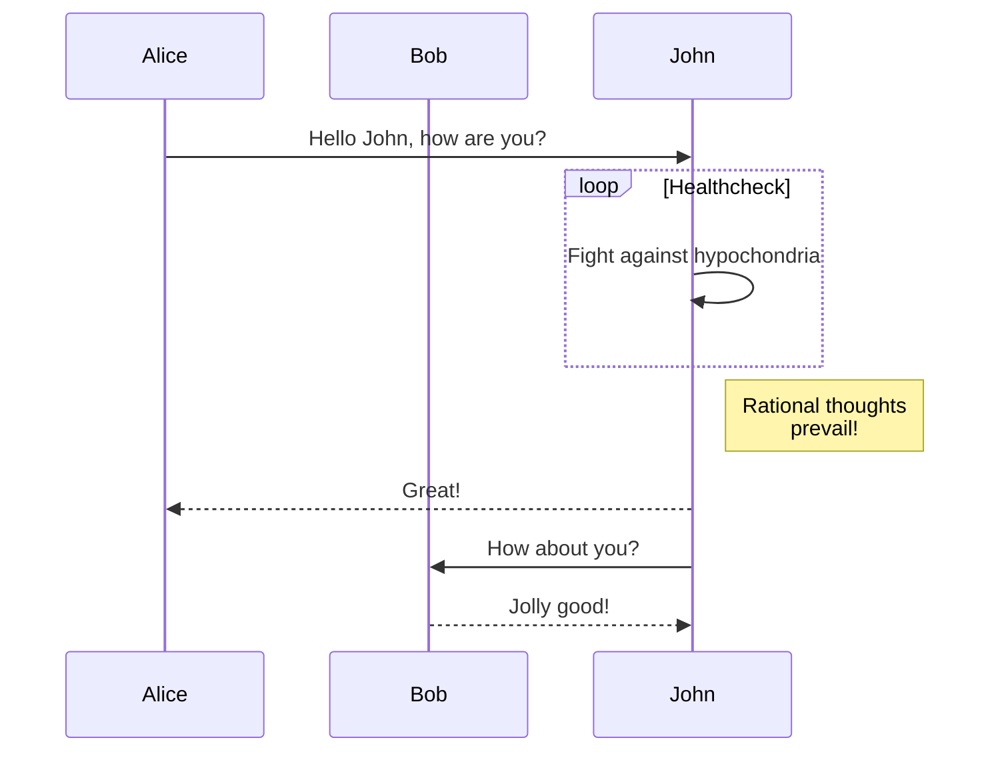

Currently, Documentation supports [Mermaid](#mermaid) for diagrams.

## Mermaid

[Mermaid](https://github.com/mermaid-js/mermaid#readme) is a JavaScript based diagramming and charting tool that takes Markdown-inspired text definitions and creates diagrams dynamically in the browser. For example, Mermaid can render flow charts, sequence diagrams, pie charts and more.

Using Mermaid in Hextra is as simple as writing a code block with language set `mermaid`:

````markdown

````

will be rendered as:


Sequence diagram:



For more information, please refer to [Mermaid Documentation](https://mermaid-js.github.io/mermaid/#/).


## GoAT

[GoAT](https://github.com/blampe/goat/) rendering an ASCII-art to SVG
### Trees
````markdown
```goat

          .               .                .               .--- 1          .-- 1     / 1
         / \              |                |           .---+            .-+         +
        /   \         .---+---.         .--+--.        |   '--- 2      |   '-- 2   / \ 2
       +     +        |       |        |       |    ---+            ---+          +
      / \   / \     .-+-.   .-+-.     .+.     .+.      |   .--- 3      |   .-- 3   \ / 3
     /   \ /   \    |   |   |   |    |   |   |   |     '---+            '-+         +
     1   2 3   4    1   2   3   4    1   2   3   4         '--- 4          '-- 4     \ 4


```
````
```goat

          .               .                .               .--- 1          .-- 1     / 1
         / \              |                |           .---+            .-+         +
        /   \         .---+---.         .--+--.        |   '--- 2      |   '-- 2   / \ 2
       +     +        |       |        |       |    ---+            ---+          +
      / \   / \     .-+-.   .-+-.     .+.     .+.      |   .--- 3      |   .-- 3   \ / 3
     /   \ /   \    |   |   |   |    |   |   |   |     '---+            '-+         +
     1   2 3   4    1   2   3   4    1   2   3   4         '--- 4          '-- 4     \ 4


```

### Line Decorations
````markdown
```goat
                ________                            o        *          *   .--------------.
   *---+--.    |        |     o   o      |         ^          \        /   |  .----------.  |
       |   |    '--*   -+-    |   |      v        /            \      /    | |  <------.  | |
       |    '----->       .---(---'  --->*<---   /      .+->*<--o----'     | |          | | |
   <--'  ^  ^             |   |                 |      | |  ^    \         |  '--------'  | |
          \/        *-----'   o     |<----->|   '-----'  |__|     v         '------------'  |
          /\                                                               *---------------'

```
````
```goat
                ________                            o        *          *   .--------------.
   *---+--.    |        |     o   o      |         ^          \        /   |  .----------.  |
       |   |    '--*   -+-    |   |      v        /            \      /    | |  <------.  | |
       |    '----->       .---(---'  --->*<---   /      .+->*<--o----'     | |          | | |
   <--'  ^  ^             |   |                 |      | |  ^    \         |  '--------'  | |
          \/        *-----'   o     |<----->|   '-----'  |__|     v         '------------'  |
          /\                                                               *---------------'

```

### Line Ends
````markdown
```goat
   o--o    *--o     /  /   *  o  o o o o   * * * *   o o o o   * * * *      o o o o   * * * *
   o--*    *--*    v  v   ^  ^   | | | |   | | | |    \ \ \ \   \ \ \ \    / / / /   / / / /
   o-->    *-->   *  o   /  /    o * v '   o * v '     o * v \   o * v \  o * v /   o * v /
   o---    *---
                                 ^ ^ ^ ^   . . . .   ^ ^ ^ ^   \ \ \ \      ^ ^ ^ ^   / / / /
   |  |   *  o  \  \   *  o      | | | |   | | | |    \ \ \ \   \ \ \ \    / / / /   / / / /
   v  v   ^  ^   v  v   ^  ^     o * v '   o * v '     o * v \   o * v \  o * v /   o * v /
   *  o   |  |    *  o   \  \

   <--o   <--*   <-->   <---      ---o   ---*   --->   ----      *<--   o<--   -->o   -->*
```
````
```goat
   o--o    *--o     /  /   *  o  o o o o   * * * *   o o o o   * * * *      o o o o   * * * *
   o--*    *--*    v  v   ^  ^   | | | |   | | | |    \ \ \ \   \ \ \ \    / / / /   / / / /
   o-->    *-->   *  o   /  /    o * v '   o * v '     o * v \   o * v \  o * v /   o * v /
   o---    *---
                                 ^ ^ ^ ^   . . . .   ^ ^ ^ ^   \ \ \ \      ^ ^ ^ ^   / / / /
   |  |   *  o  \  \   *  o      | | | |   | | | |    \ \ \ \   \ \ \ \    / / / /   / / / /
   v  v   ^  ^   v  v   ^  ^     o * v '   o * v '     o * v \   o * v \  o * v /   o * v /
   *  o   |  |    *  o   \  \

   <--o   <--*   <-->   <---      ---o   ---*   --->   ----      *<--   o<--   -->o   -->*
```

### Nodes
````markdown
```goat

   .---.       .-.        .-.       .-.                                       .-.
   | A +----->| 1 +<---->| 2 |<----+ 4 +------------------.                  | 8 |
   '---'       '-'        '+'       '-'                    |                  '-'
                           |         ^                     |                   ^
                           v         |                     v                   |
                          .-.      .-+-.        .-.      .-+-.      .-.       .+.       .---.
                         | 3 +---->| B |<----->| 5 +---->| C +---->| 6 +---->| 7 |<---->| D |
                          '-'      '---'        '-'      '---'      '-'       '-'       '---'

```
````
```goat

   .---.       .-.        .-.       .-.                                       .-.
   | A +----->| 1 +<---->| 2 |<----+ 4 +------------------.                  | 8 |
   '---'       '-'        '+'       '-'                    |                  '-'
                           |         ^                     |                   ^
                           v         |                     v                   |
                          .-.      .-+-.        .-.      .-+-.      .-.       .+.       .---.
                         | 3 +---->| B |<----->| 5 +---->| C +---->| 6 +---->| 7 |<---->| D |
                          '-'      '---'        '-'      '---'      '-'       '-'       '---'

```

### Grids
````markdown
```goat
    .----.        .----.
   /      \      /      \            .-----+-----+-----.
  +        +----+        +----.      |     |     |     |          .-----+-----+-----+-----+
   \      /      \      /      \     |     |     |     |         /     /     /     /     /
    +----+   B    +----+        +    +-----+-----+-----+        +-----+-----+-----+-----+
   /      \      /      \      /     |     |     |     |       /     /     /     /     /
  +   A    +----+        +----+      |     |  B  |     |      +-----+-----+-----+-----+
   \      /      \      /      \     +-----+-----+-----+     /     /  A  /  B  /     /
    '----+        +----+        +    |     |     |     |    +-----+-----+-----+-----+
          \      /      \      /     |  A  |     |     |   /     /     /     /     /
           '----'        '----'      '-----+-----+-----'  '-----+-----+-----+-----+


```
````
```goat
    .----.        .----.
   /      \      /      \            .-----+-----+-----.
  +        +----+        +----.      |     |     |     |          .-----+-----+-----+-----+
   \      /      \      /      \     |     |     |     |         /     /     /     /     /
    +----+   B    +----+        +    +-----+-----+-----+        +-----+-----+-----+-----+
   /      \      /      \      /     |     |     |     |       /     /     /     /     /
  +   A    +----+        +----+      |     |  B  |     |      +-----+-----+-----+-----+
   \      /      \      /      \     +-----+-----+-----+     /     /  A  /  B  /     /
    '----+        +----+        +    |     |     |     |    +-----+-----+-----+-----+
          \      /      \      /     |  A  |     |     |   /     /     /     /     /
           '----'        '----'      '-----+-----+-----'  '-----+-----+-----+-----+


```

### Complicated
````markdown
```goat
+-------------------+                           ^                      .---.
|    A Box          |__.--.__    __.-->         |      .-.             |   |
|                   |        '--'               v     | * |<---        |   |
+-------------------+                                  '-'             |   |
                       Round                                       *---(-. |
  .-----------------.  .-------.    .----------.         .-------.     | | |
 |   Mixed Rounded  | |         |  / Diagonals  \        |   |   |     | | |
 | & Square Corners |  '--. .--'  /              \       |---+---|     '-)-'       .--------.
 '--+------------+-'  .--. |     '-------+--------'      |   |   |       |        / Search /
    |            |   |    | '---.        |               '-------'       |       '-+------'
    |<---------->|   |    |      |       v                Interior                 |     ^
    '           <---'      '----'   .-----------.              ---.     .---       v     |
 .------------------.  Diag line    | .-------. +---.              \   /           .     |
 |   if (a > b)     +---.      .--->| |       | |    | Curved line  \ /           / \    |
 |   obj->fcn()     |    \    /     | '-------' |<--'                +           /   \   |
 '------------------'     '--'      '--+--------'      .--. .--.     |  .-.     +Done?+-'
    .---+-----.                        |   ^           |\ | | /|  .--+ |   |     \   /
    |   |     | Join        \|/        |   | Curved    | \| |/ | |    \    |      \ /
    |   |     +---->  o    --o--        '-'  Vertical  '--' '--'  '--  '--'        +  .---.
 <--+---+-----'       |     /|\                                                    |  | 3 |
                      v                             not:line    'quotes'        .-'   '---'
  .-.             .---+--------.            /            A || B   *bold*       |        ^
 |   |           |   Not a dot  |      <---+---<--    A dash--is not a line    v        |
  '-'             '---------+--'          /           Nor/is this.            ---
```
````
```goat
+-------------------+                           ^                      .---.
|    A Box          |__.--.__    __.-->         |      .-.             |   |
|                   |        '--'               v     | * |<---        |   |
+-------------------+                                  '-'             |   |
                       Round                                       *---(-. |
  .-----------------.  .-------.    .----------.         .-------.     | | |
 |   Mixed Rounded  | |         |  / Diagonals  \        |   |   |     | | |
 | & Square Corners |  '--. .--'  /              \       |---+---|     '-)-'       .--------.
 '--+------------+-'  .--. |     '-------+--------'      |   |   |       |        / Search /
    |            |   |    | '---.        |               '-------'       |       '-+------'
    |<---------->|   |    |      |       v                Interior                 |     ^
    '           <---'      '----'   .-----------.              ---.     .---       v     |
 .------------------.  Diag line    | .-------. +---.              \   /           .     |
 |   if (a > b)     +---.      .--->| |       | |    | Curved line  \ /           / \    |
 |   obj->fcn()     |    \    /     | '-------' |<--'                +           /   \   |
 '------------------'     '--'      '--+--------'      .--. .--.     |  .-.     +Done?+-'
    .---+-----.                        |   ^           |\ | | /|  .--+ |   |     \   /
    |   |     | Join        \|/        |   | Curved    | \| |/ | |    \    |      \ /
    |   |     +---->  o    --o--        '-'  Vertical  '--' '--'  '--  '--'        +  .---.
 <--+---+-----'       |     /|\                                                    |  | 3 |
                      v                             not:line    'quotes'        .-'   '---'
  .-.             .---+--------.            /            A || B   *bold*       |        ^
 |   |           |   Not a dot  |      <---+---<--    A dash--is not a line    v        |
  '-'             '---------+--'          /           Nor/is this.            ---
```

For more information, please refer to [GoAT Project page](https://github.com/blampe/goat/).
